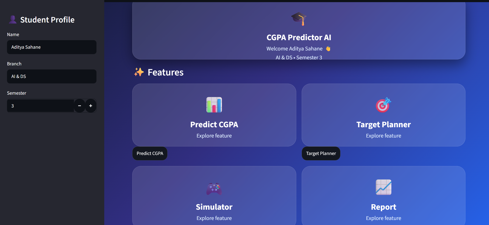

<div align="center">

# 🎓 CGPA Predictor AI

### Machine Learning Based Academic Performance Analyzer


</div>


---

## 🚀 Overview

CGPA Predictor AI is an intelligent web application that helps students:

✨ Predict expected CGPA  
✨ Analyze subject performance  
✨ Plan target CGPA  
✨ Find weak and strong areas  


---

## 🖥️ Application Preview





---

# ⭐ Features


<table>

<tr>

<td width="50%">

## 📊 CGPA Predictor

Enter CIE + SEE marks

Get:

- Predicted Grade Point
- Final CGPA
- Performance Analysis

</td>


<td width="50%">

## 🎯 Target Planner

Enter:

- Current CIE
- Target CGPA

Find required SEE marks

</td>

</tr>


<tr>

<td>

## 🎮 Simulator

Try different marks combinations.

See instant CGPA changes.

</td>


<td>

## 📄 Report Card

Generates:

- Student Details
- Subject Analysis
- Strengths
- Improvements

</td>

</tr>

</table>


---

# 🧠 Machine Learning


```python
Input:

CIE Marks
SEE Marks


Output:

Predicted Grade Point